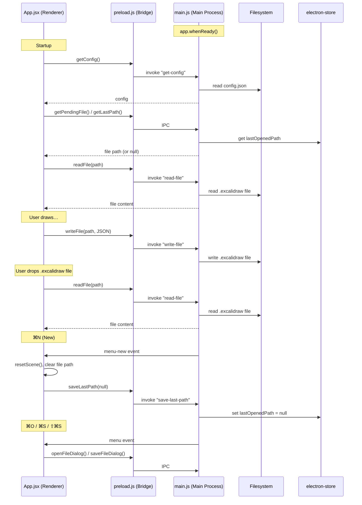

# Excalidraw Mac

A desktop application for [Excalidraw](https://excalidraw.com/), which auto-saves your drawings to local files.

## Architecture



## Design Considerations

### #1 Why CommonJS?

Electron's sandboxed preload scripts [don't support ESM](https://www.electronjs.org/docs/latest/tutorial/esm#sandboxed-preload-scripts-cant-use-esm-imports), so `preload.js` and `main.js` must use `require()`. This is why `package.json` sets `"type": "commonjs"`. The renderer files under `excalidraw-app/src/` still use ESM `import`/`export` — Vite handles those, not Node.js.

[`electron-store`](https://github.com/sindresorhus/electron-store) moved to ESM-only in recent versions, and dynamic `import()` breaks inside packaged asar archives. To stay compatible, this project pins **v8** (the last CJS release).

### #2 Why is fs.writeFileSync used instead of fileHandle.createWritable()?

- `fileHandle.createWritable()` is a browser [File System Access API](https://developer.mozilla.org/en-US/docs/Web/API/FileSystemWritableFileStream) — it runs in the renderer, which is sandboxed and shouldn't own filesystem operations
- `FileSystemFileHandle` objects can't be sent across the IPC boundary (not serializable)
- `fs.writeFileSync` runs in the **main process** (privileged), following Electron's security model: renderer requests → main process executes
- Content is serialized via Excalidraw's `serializeAsJSON()` which outputs the standard `.excalidraw` JSON format

## Getting Started

1. Set your preferences in `config.json` (window size, auto-save timing, default open directory).
2. Run `npm run compile` — this lints, formats, builds, and packages the DMG in one step.

```bash
npm install
npm run compile   # lint → format → build → package DMG
```

### Scripts

| Command           | Description                                       |
| ----------------- | ------------------------------------------------- |
| `npm start`       | Launch the Electron app (requires a prior build)  |
| `npm run dev`     | Start the Vite dev server (renderer only)         |
| `npm run build`   | Build the renderer app for production             |
| `npm run dmg`     | Package the app into a DMG using electron-builder |
| `npm run compile` | Lint → Format → Build → Package DMG               |
| `npm run lint`    | Run ESLint                                        |
| `npm run format`  | Run Prettier                                      |

## Known Limitations

### Drag-and-drop + undo can lose images

If you drag and drop images onto the canvas and then undo, the embedded image data will be lost. To be safe, keep a backup of your `.excalidraw` file before drag-and-drop operations involving images.

## Updating Excalidraw Fonts

After upgrading the `@excalidraw/excalidraw` package, re-copy the font assets:

```bash
npm install @excalidraw/excalidraw@latest
cp -r node_modules/@excalidraw/excalidraw/dist/prod/fonts excalidraw-app/public/
```

## References

- [Excalidraw GitHub Repository](https://github.com/excalidraw/excalidraw)
- [Excalidraw Documentation](https://docs.excalidraw.com/)
